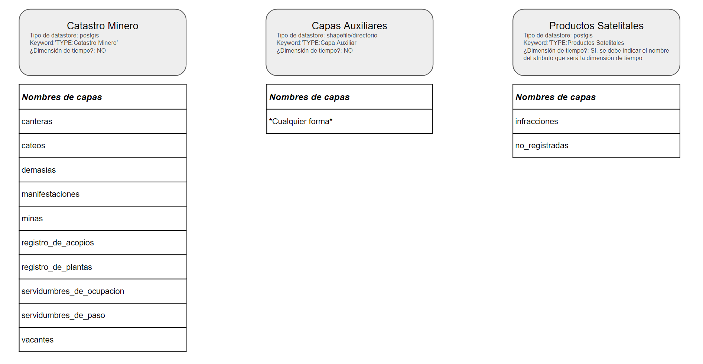

## Running the app

```bash
# development
$ npm run start

# watch mode
$ npm run start:dev

# production mode
$ npm run start:prod
```

## Requerimientos GEOSERVER

[GDAL Plugin](https://docs.geoserver.org/stable/en/user/data/raster/gdal.html)
[Download](https://build.geoserver.org/geoserver/2.21.x/ext-latest/geoserver-2.21-SNAPSHOT-gdal-plugin.zip)

```
Extensiones de Geoserver.

gdal-3.2.0
gs-gdal-2.21-SNAPSHOT
```

## Inicializacion

```bash
./init_store.sh <workspace> <store>
```

Ejemplo

```bash
./init_store.sh invap rasters
```

## Config json Raster (raster.json)

```
{
  "action": { "DataType": "String", "StringValue": "semaforo" },
  "folder": { "DataType": "String", "StringValue": "publicador/rasters" },
  "store": { "DataType": "String", "StringValue": "canteras" },
  "type": { "DataType": "String", "StringValue": "tif" }
}
```

## Config json shapefile (shapefile.json)

```
{
  "action": { "DataType": "String", "StringValue": "shapefile" },
  "folder": { "DataType": "String", "StringValue": "publicador/semaforo2/" },
  "multiplesfiles": { "DataType": "String", "StringValue": "false" },
  "filename": {
    "DataType": "String",
    "StringValue": "semaforo_canteras_faja4"
  },
  "type": { "DataType": "String", "StringValue": "shp" }
}

```

## Test ShaperFile

```bash
# development
$ cd ./test
$ /publish.sh shapefile

```

## Test Raster

```bash
# development
$ cd ./test
$ /publish.sh raster

```

## Variables de entorno

El aplicativo hace uso de un archivo para configurar las variables de entorno. Las variables de entorno que se deben configurar son las que se encuentran en el archivo `env.example` provisto en la raíz de esta app.

En la ruta `./src/config/envs/` se deben guardar los archivos que leera el aplicativo (basándose en el paquete `dotenv` dentro de NestJS) con la siguiente nomenclatura: `**ENVIROMENTE**.env`.

El nombre **ENVIROMENT** viene de la variable de entorno `NODE_ENV`. Se representa un ejemplo del nombre del archivo:

- `NODE_ENV=interno` -> el app buscará el archivo `interno.env` dentro de la carpeta `./src/config/envs/`.

En caso de no existir la variable, se busca el archivo `development.env`

## Migraciones

Se configura la app para poder subir o bajar de migraciones a partir del comando `npm typeorm...` añadiendo el scritp en el documento `package.json`. Para subir y/o bajar de migración se pueden usar los isguientes comandos:

- Para subir de hasta la última migración: `npm run typeorm migration:run`.
- Para bajar una versión de migración: `npm run typerom migration:revert`

## Configuración de Capas del Geoserver

Este publicador es el puente de comunicación entre el servidor back-end (cola de mensajes SQS de AWS) y el geoserver. Según esta configuración, se tendrán 3 fuentes de datos para las capas:

- Catastro Minero
- Productos Satelitales
- Capas Auxiliares



### Catastro Minero:

Cada capa del Catastro Minero tendrá el *keyword* `TYPE:Catastro Minero`, estarán almacenados en un *datastore* tipo PostGIS y estarán configurados según el archivo `src\common\constants\capas-catastro-minero.ts`.

La siguiente tabla muestra la configuración entre los atributos del archivo .zip y las tablas guardadas en PostgreSQL/PostGIS.


| Tabla                     | Archivo ZIP| Columna        | isPK? | isNullable? | Tipo                    | Longitud |
|---------------------------|------------|----------------|-------|-------------|-------------------------|----------|
| canteras                  |            | id             | SI    |             | integer                 |          |
| canteras                  |            | geom           |       |             | geometry(Geometry,4326) |          |
| canteras                  | expediente | expediente     |       | SI          | varchar                 | 255      |
| canteras                  | titular    | titular        |       | SI          | varchar                 | 255      |
| canteras                  | nombre     | nombre         |       | SI          | varchar                 | 255      |
| canteras                  | mineral    | mineral        |       | SI          | varchar                 | 255      |
| canteras                  | categoria  | categoria      |       | SI          | integer                 |          |
| canteras                  | superficie | superficie     |       | SI          | double precision        |          |
| cateos                    |            | id             | SI    |             | integer                 |          |
| cateos                    |            | geom           |       |             | geometry(Geometry,4326) |          |
| cateos                    | expediente | expediente     |       | SI          | varchar                 | 255      |
| cateos                    | titular    | titular        |       | SI          | varchar                 | 255      |
| cateos                    | nombre     | nombre         |       | SI          | varchar                 | 255      |
| cateos                    | superficie | superficie     |       | SI          | double precision        |          |
| demasias                  |            | id             | SI    |             | integer                 |          |
| demasias                  |            | geom           |       |             | geometry(Geometry,4326) |          |
| demasias                  | expediente | expediente     |       | SI          | varchar                 | 255      |
| demasias                  | titular    | titular        |       | SI          | varchar                 | 255      |
| demasias                  | nombre     | nombre         |       | SI          | varchar                 | 255      |
| demasias                  | mineral    | mineral        |       | SI          | varchar                 | 255      |
| demasias                  | categoria  | categoria      |       | SI          | integer                 |          |
| demasias                  | superficie | superficie     |       | SI          | double precision        |          |
| manifestaciones           |            | id             | SI    |             | integer                 |          |
| manifestaciones           |            | geom           |       |             | geometry(Geometry,4326) |          |
| manifestaciones           | expediente | expediente     |       | SI          | varchar                 | 255      |
| manifestaciones           | titular    | titular        |       | SI          | varchar                 | 255      |
| manifestaciones           | nombre     | nombre         |       | SI          | varchar                 | 255      |
| manifestaciones           | mineral    | mineral        |       | SI          | varchar                 | 255      |
| manifestaciones           | categoria  | categoria      |       | SI          | integer                 |          |
| manifestaciones           | superficie | superficie     |       | SI          | double precision        |          |
| minas                     |            | id             | SI    |             | integer                 |          |
| minas                     |            | geom           |       |             | geometry(Geometry,4326) |          |
| minas                     | expediente | expediente     |       | SI          | varchar                 | 255      |
| minas                     | titular    | titular        |       | SI          | varchar                 | 255      |
| minas                     | nombre     | nombre         |       | SI          | varchar                 | 255      |
| minas                     | mineral    | mineral        |       | SI          | varchar                 | 255      |
| minas                     | categoria  | categoria      |       | SI          | integer                 |          |
| minas                     | superficie | superficie     |       | SI          | double precision        |          |
| registro_de_acopios       |            | id             | SI    |             | integer                 |          |
| registro_de_acopios       |            | geom           |       |             | geometry(Geometry,4326) |          |
| registro_de_acopios       | EXPTE      | expediente     |       | SI          | varchar                 | 255      |
| registro_de_acopios       | NRO_ACOPIO | acopio         |       | SI          | varchar                 | 255      |
| registro_de_acopios       | EMPRESA    | empresa        |       | SI          | varchar                 | 255      |
| registro_de_acopios       | PROP_REPR  | prop_repr      |       | SI          | varchar                 | 255      |
| registro_de_acopios       | DOMICILIO  | domicilio      |       | SI          | varchar                 | 255      |
| registro_de_acopios       | DNI        | dni            |       | SI          | varchar                 | 255      |
| registro_de_acopios       | UBICACION_ | ubicacion      |       | SI          | varchar                 | 255      |
| registro_de_acopios       | LOCALIDAD  | localidad      |       | SI          | varchar                 | 255      |
| registro_de_acopios       | C_P        | c_p            |       | SI          | varchar                 | 255      |
| registro_de_acopios       | TEL_FAX    | tel_fax        |       | SI          | varchar                 | 255      |
| registro_de_acopios       | E_MAIL     | e_mail         |       | SI          | varchar                 | 255      |
| registro_de_acopios       | YAC_PROVEE | yac_provee     |       | SI          | varchar                 | 255      |
| registro_de_acopios       | MINERAL    | mineral        |       | SI          | varchar                 | 255      |
| registro_de_plantas       |            | id             | SI    |             | integer                 |          |
| registro_de_plantas       |            | geom           |       |             | geometry(Geometry,4326) |          |
| registro_de_plantas       | nº expte   | expediente     |       | SI          | varchar                 | 255      |
| registro_de_plantas       | empresa    | empresa        |       | SI          | varchar                 | 255      |
| registro_de_plantas       | titular    | titular        |       | SI          | varchar                 | 255      |
| registro_de_plantas       | apoderado/ | apoderado      |       | SI          | varchar                 | 255      |
| registro_de_plantas       | tipo de pl | tipo_de_pl     |       | SI          | varchar                 | 255      |
| registro_de_plantas       | materia pr | materia_pr     |       | SI          | varchar                 | 255      |
| registro_de_plantas       | proceso de | proceso_de     |       | SI          | varchar                 | 255      |
| registro_de_plantas       | producto f | producto_f     |       | SI          | varchar                 | 255      |
| registro_de_plantas       | yacimiento | yacimiento     |       | SI          | varchar                 | 255      |
| registro_de_plantas       | personal   | personal       |       | SI          | varchar                 | 255      |
| registro_de_plantas       | % empleo l | porc_empleo_l  |       | SI          | varchar                 | 255      |
| registro_de_plantas       | inversione | inversiones    |       | SI          | varchar                 | 255      |
| registro_de_plantas       | instalacio | instalacion    |       | SI          | varchar                 | 255      |
| registro_de_plantas       | volumen de | volumen_de     |       | SI          | varchar                 | 255      |
| registro_de_plantas       | promedio m | promedio_m     |       | SI          | varchar                 | 255      |
| registro_de_plantas       | comerciali | comerciali     |       | SI          | varchar                 | 255      |
| registro_de_plantas       | exportacio | exportacion    |       | SI          | varchar                 | 255      |
| registro_de_plantas       | domicilio  | domicilio      |       | SI          | varchar                 | 255      |
| registro_de_plantas       | tel/fax    | tel_fax        |       | SI          | varchar                 | 255      |
| registro_de_plantas       | email      | email          |       | SI          | varchar                 | 255      |
| registro_de_plantas       | dja        | dja            |       | SI          | varchar                 | 255      |
| registro_de_plantas       | fecha de p | fecha_de_p     |       | SI          | varchar                 | 255      |
| registro_de_plantas       | sellado de | sellado_de     |       | SI          | varchar                 | 255      |
| registro_de_plantas       | observacio | observaciones  |       | SI          | varchar                 | 255      |
| servidumbres_de_ocupacion |            | id             | SI    |             | integer                 |          |
| servidumbres_de_ocupacion |            | geom           |       |             | geometry(Geometry,4326) |          |
| servidumbres_de_ocupacion | EXPEDIENTE | expediente     |       | SI          | varchar                 | 255      |
| servidumbres_de_ocupacion | TITULAR    | titular        |       | SI          | varchar                 | 255      |
| servidumbres_de_ocupacion | SUPERFICIE | superficie     |       | SI          | double precision        |          |
| servidumbres_de_paso      |            | id             | SI    |             | integer                 |          |
| servidumbres_de_paso      |            | geom           |       |             | geometry(Geometry,4326) |          |
| servidumbres_de_paso      | EXPEDIENTE | expediente     |       | SI          | varchar                 | 255      |
| servidumbres_de_paso      | TITULAR    | titular        |       | SI          | varchar                 | 255      |
| servidumbres_de_paso      | LONG (M)   | long_m         |       | SI          | double precision        |          |
| vacantes                  |            | id             | SI    |             | integer                 |          |
| vacantes                  |            | geom           |       |             | geometry(Geometry,4326) |          |
| vacantes                  | expediente | expediente     |       | SI          | varchar                 | 255      |
| vacantes                  | titular    | titular        |       | SI          | varchar                 | 255      |
| vacantes                  | nombre     | nombre         |       | SI          | varchar                 | 255      |
| vacantes                  | mineral    | mineral        |       | SI          | varchar                 | 255      |
| vacantes                  | categoria  | categoria      |       | SI          | integer                 |          |
| vacantes                  | superficie | superficie     |       | SI          | double precision        |

Los pasos para actualizar alguna de las capas del **Catastro Minero** son:

1. Se debe enviar un mensaje al publicador con los siguientes atributos:
```
  {
    layerType: 'raster' | 'vectorial'; // Vectorial
    workspace?: string; // En caso de no enviar el workspace, se tomará el valor de la variable de entorno configurada
    datastore: string; // El datastore en el geoserver debe ser PostGIS
    layerName: string; // Nombre de la capa a actualizar. Este debe coincidir con el nombre de la tabla en PostgreSQL (visto en tabla anterior)
    datasource: 'CM' | 'PS' | 'CA'; // Indicar 'CM'
    timeDimension?: any; // NA
    style?: string; // Opcional
    path: string; // Path en AWS.S3 donde se encuentra el archivo .zip
    fileName?: string; // Nombre del archivo .zip
  }
```
2. El publicador recibirá el mensaje y lo enviará al método adecuado, en este caso, al manejador de **Catastro Minero**.
3. Se verificará que en el mensaje esté el atributo `fileName`, de lo contrario generará error y finalizará.
4. Se extrae el archivo desde AWS.S3.
5. Se extrae la capa y los atributos de la geometría que se subirán a la base de datos PostgreSQL/PostGIS. En caso de no existir capa configurada, se genera error.
6. Se verifica que el datastore sea tipo **PostGIS**.
7. Se eliminan los datos y se suben los nuevos a la tabla configurada.
8. Se verifica la existencia de la capa. En caso que no exista, se crea una nueva.
9. Se verifica el estilo para la capa. En caso de que no haya y no venga el documento .sld dentro del .zip, se configura uno genérico.
10. Se finaliza el publicador.

### Capas Auxiliares:

Cada capa de las Capas Auxiliares tendrá el *keyword* `TYPE:Capas Auxiliares` y estarán almacenados en un *datastore* tipo PostGIS. No tienen configuración alguna, sin embargo, los archivos no pueden llevar ninguno de los siguientes nombre:

- Nombres de las tablas de **Catastro Minero**
- Nombres de las tablas de **Productos Satelitales**

Los pasos para actualizar alguna de las capas del **Capas Auxiliares** son:

1. Se debe enviar un mensaje al publicador con los siguientes atributos:
```
  {
    layerType: 'raster' | 'vectorial'; // Vectorial
    workspace?: string; // En caso de no enviar el workspace, se tomará el valor de la variable de entorno configurada
    datastore: string; // El datastore en el geoserver debe ser PostGIS
    layerName: string; // NO HACE FALTA ENVIAR NOMBRE YA QUE EL NOMBRE DE LA CAPA ES EL NOMBRE DEL ARCHIVO .SHP
    datasource: 'CM' | 'PS' | 'CA'; // Indicar 'CA'
    timeDimension?: any; // NA
    style?: string; // NA
    path: string; // Path en AWS.S3 donde se encuentra el archivo .zip
    fileName?: string; // Nombre del archivo .zip
  }
```
2. El publicador recibirá el mensaje y lo enviará al método adecuado, en este caso, al manejador de **Capas Auxiliares**.
3. Se verificará que en el mensaje esté el atributo `fileName`, de lo contrario generará error y finalizará.
4. Se extrae el archivo desde AWS.S3.
5. Se verifica si la capa ya existe en el servidor GeoServer. En caso de existir, se elimina.
5. Se verifica si la tabla ya existe en la base de datos PostgreSQL. En caso de existir, se elimina.
6. Se reinicia el caché del servidor.
7. Se sube el archivo al GeoServer directamente.
8. Se actualizan las capas para con la keyword correspondiente.
10. Se finaliza el publicador.

### Productos Satelitales:

Cada capa del Catastro Minero tendrá el *keyword* `TYPE:Productos Satelitales`, estarán almacenados en un *datastore* tipo PostGIS y estarán configurados según el archivo `src\common\constants\capas-productos-satelitales.ts`.

A diferencia de las capas en `Catastro Minero`, estas contendrán un atributo especial de tiempo que se insertará en su metadata.

La siguiente tabla muestra la configuración entre los atributos del archivo .zip y las tablas guardadas en PostgreSQL/PostGIS.

| Tabla          | Archivo ZIP | Columna   | isPK? | isNullable? | Tipo                     | Longitud |
|----------------|-------------|-----------|-------|-------------|--------------------------|----------|
| infracciones   |             | id        | SI    |             | integer                  |          |
| infracciones   |             | geom      |       | NO          | geometry(GeometryZ,4326) |          |
| infracciones   | FECHA       | fecha     |       | NO          | date                     |          |
| infracciones   | PROC        | proc      |       | SI          | date                     |          |
| infracciones   | FLUJO       | flujo     |       | SI          | varchar                  | 254      |
| infracciones   | VERSION     | version   |       | SI          | varchar                  | 254      |
| infracciones   | SATELITE    | satelite  |       | SI          | varchar                  | 254      |
| infracciones   | ID          | exp_id    |       | SI          | varchar                  | 20       |
| infracciones   | CATEGORIA   | categoria |       | SI          | integer                  |          |
| no_registradas |             | id        | SI    |             | integer                  |          |
| no_registradas |             | geom      |       | NO          | geometry(GeometryZ,4326) |          |
| no_registradas | FECHA       | fecha     |       | NO          | date                     |          |
| no_registradas | PROC        | proc      |       | SI          | date                     |          |
| no_registradas | FLUJO       | flujo     |       | SI          | varchar                  | 254      |
| no_registradas | VERSION     | version   |       | SI          | varchar                  | 254      |
| no_registradas | SATELITE    | satelite  |       | SI          | varchar                  | 254      |
| no_registradas | ID          | exp_id    |       | SI          | varchar                  | 20       |
| no_registradas | CATEGORIA   | categoria |       | SI          | integer                  |

Los pasos para actualizar alguna de las capas del **Productos Satelitales** son:

1. Se debe enviar un mensaje al publicador con los siguientes atributos:
```
  {
    layerType: 'raster' | 'vectorial'; // Vectorial
    workspace?: string; // En caso de no enviar el workspace, se tomará el valor de la variable de entorno configurada
    datastore: string; // El datastore en el geoserver debe ser PostGIS
    layerName: string; // Nombre de la capa a actualizar. Este debe coincidir con el nombre de la tabla en PostgreSQL (visto en tabla anterior)
    datasource: 'CM' | 'PS' | 'CA'; // Indicar 'PS'
    timeDimension?: any; // Se debe indicar cual atributo es el que corresponde a la dimensión de tiempo (la columna 'fecha' por ejemplo)
    style?: string; // Opcional
    path: string; // Path en AWS.S3 donde se encuentra el archivo .zip
    fileName?: string; // Nombre del archivo .zip
  }
```
2. El publicador recibirá el mensaje y lo enviará al método adecuado, en este caso, al manejador de **Productos Satelitales**.
3. Se verificará que en el mensaje esté el atributo `fileName`, de lo contrario generará error y finalizará.
4. Se extrae el archivo desde AWS.S3.
5. Se extrae la capa y los atributos de la geometría que se subirán a la base de datos PostgreSQL/PostGIS. En caso de no existir capa configurada, se genera error.
6. Se verifica que el datastore sea tipo **PostGIS**.
7. Se eliminan los datos y se suben los nuevos a la tabla configurada.
8. Se verifica la existencia de la capa. En caso que no exista, se crea una nueva.
9. Se verifica el estilo para la capa. En caso de que no haya y no venga el documento .sld dentro del .zip, se configura uno genérico.
10. Se finaliza el publicador.